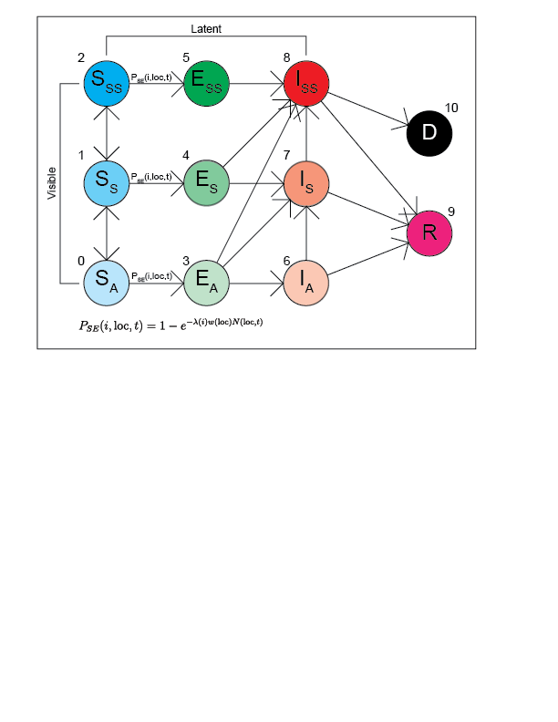

### CoViD Model (Updated 200701)

Just to recap; each agent "owns" two Markov chains. One determines location and is completely independent and the other one determines state and is dependant on the agent's current location. The state chain is shown below.

All model code has been put into a separate module for easier use.

Visualization code has been re-vamped. Now all SEIRD groups are visible and plotted; symptoms are represented by transparency of an agent. Simulations are now plotted on the Caltech campus with around 10 labs being represented.

Below is a simulation showing the effects of closing down Chandler.

In addition to this, Testing/Quarantine/State Forecasting have all been implemented. Below is a simulation showing the differences in outcome between a campus that tests/quarantines everyone vs a campus that tests/quarantines nobody.

(Sensitivity parameter had to be lowered substantially as testing is only done once per day)

Right now, I'm working on implementing different testing policies.