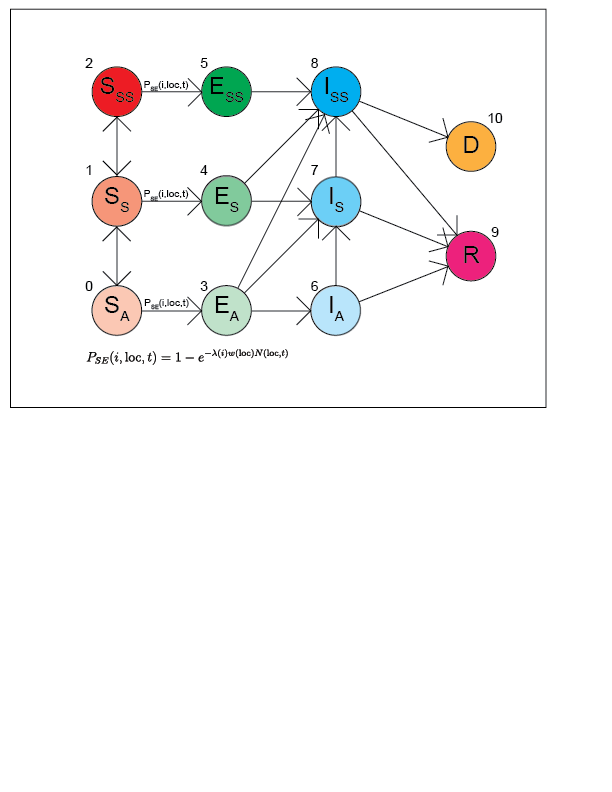

### CoViD Model (Updated 200622)

So far, I've finished modeling the movement behavior of individual agents as well as transmission between individuals. I'm doing this by running two Markov chains for each individual; one determines agent location and the other determines location state. The Markov chain for agent state was lifted directly from the notes and is below. Time intervals were kept very small at 5 minutes (every 5 minutes both chains are run once).

I've also created some visualization code so that you can see the simulation running "in real time". Creating the animations are expensive so I've set the sensitivity parameter very high (around 1e20) so that you can see mostly everyone become infected at the end of day 1.

I'm planning on implementing testing/quarantine next; along with cleaning up a lot of the code and sticking it in a module rather than a jupyter notebook.